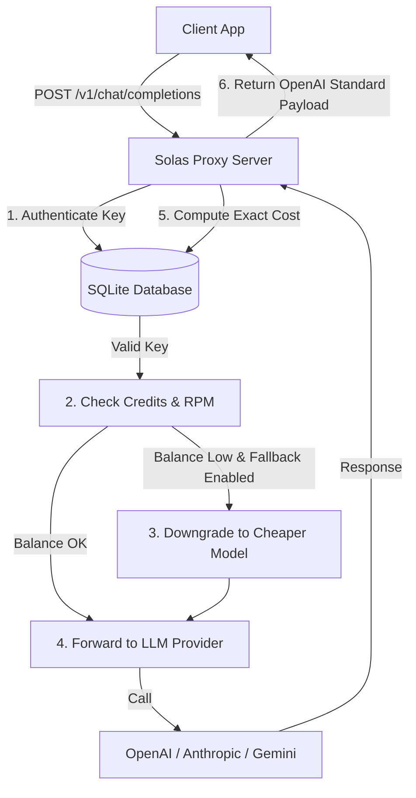

# Solas Billing Architecture Documentation

## Request Intercept Lifecycle

1. **Authentication**: The proxy extracts bearer auth and retrieves user's database entry.
2. **Checks**: Verified against Rate Limits and outstanding balance.
3. **Fallback recovery**: Automatically resolves cheaper sibling models when high-tier prompt costs exceed credits.
4. **Proxy Forward**: Requests are sent to OpenAI/Anthropic/Gemini.
5. **Billing**: Database balance decremented, logs written.
